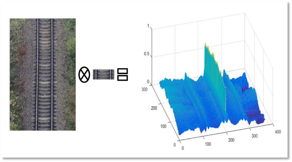
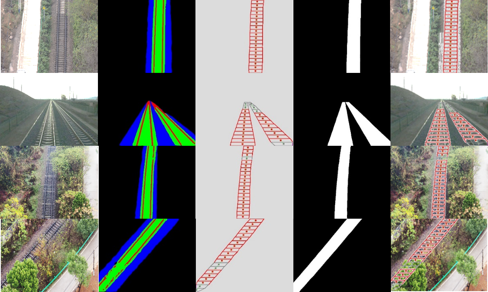

# pytorch-DFR

**Update on 2018/12/06. Provide model trained on VOC and SBD datasets.**  

**Update on 2018/11/24. Release newest version code, which fix some previous issues and also add support for new backbones and multi-gpu training. For previous code, please see in `previous` branch**  

### TODO
- [x] Support different backbones
- [x] Multi-GPU training


| Backbone  | train/eval os  |mIoU  |rIOU|
| :-------- | :------------: |:---------: |:--------------:|
| ResNet    | 16/16          | 0.814    | 0.845 |
| MobileNet | 16/16          | 0.820    | 0.856 |
| DRN       | 16/16          | 0.847    | 0.866 |
| Xception  | 16/16          | 0.840    | 0.866 |
| CSPDRN-S  | 16/16          | 0.839    | 0.867 |
| CSPDRN-M  | 16/16          | 0.841    | 0.866 |
| CSPDRN-L  | 16/16          | 0.842    | 0.869 |
| CSPDRN-X  | 16/16          | 0.850    | 0.875 |


### Introduction
This is a PyTorch(0.4.1) implementation of DFR. 







### Installation
The code was tested with Anaconda and Python 3.6. After installing the Anaconda environment:

0. Clone the repo:
    ```Shell
    git clone https://github.com/jfzhang95/pytorch-deeplab-xception.git
    cd pytorch-deeplab-xception
    ```

1. Install dependencies:

    For PyTorch dependency, see [pytorch.org](https://pytorch.org/) for more details.

    For custom dependencies:
    ```Shell
    pip install matplotlib pillow tensorboardX tqdm
    ```
### Training
Follow steps below to train your model:

0. Configure your dataset path in [mypath.py](https://github.com/ksws0499733/DFR/blob/master/mypath.py).

The dataset can be download in [baiduCloud](https://pan.baidu.com/s/1zTQU_rilu4I_klvCgxi70Q) (Extraction code: 69jq).

1. Input arguments: (see full input arguments via python train.py --help):
    ```Shell
    usage: train.py [-h] [--backbone {resnet,xception,drn,mobilenet}]
                [--out-stride OUT_STRIDE] [--dataset {iRailway}]
                [--workers N] [--base-size BASE_SIZE]
                [--crop-size CROP_SIZE] [--sync-bn SYNC_BN]
                [--freeze-bn FREEZE_BN] [--loss-type {ce,focal}] [--epochs N]
                [--start_epoch N] [--batch-size N] [--test-batch-size N]
                [--use-balanced-weights] [--lr LR]
                [--lr-scheduler {poly,step,cos}] [--momentum M]
                [--weight-decay M] [--nesterov] [--no-cuda]
                [--gpu-ids GPU_IDS] [--seed S] [--resume RESUME]
                [--checkname CHECKNAME] [--ft] [--eval-interval EVAL_INTERVAL]
                [--no-val]


### Acknowledgement
[PyTorch-Encoding](https://github.com/zhanghang1989/PyTorch-Encoding)

[Synchronized-BatchNorm-PyTorch](https://github.com/vacancy/Synchronized-BatchNorm-PyTorch)

[drn](https://github.com/fyu/drn)

[CBAM](https://github.com/elbuco1/CBAM)

[pytorch-deeplab-xception](https://github.com/jfzhang95/pytorch-deeplab-xception/)

[yolov5](https://github.com/ultralytics/yolov5)
